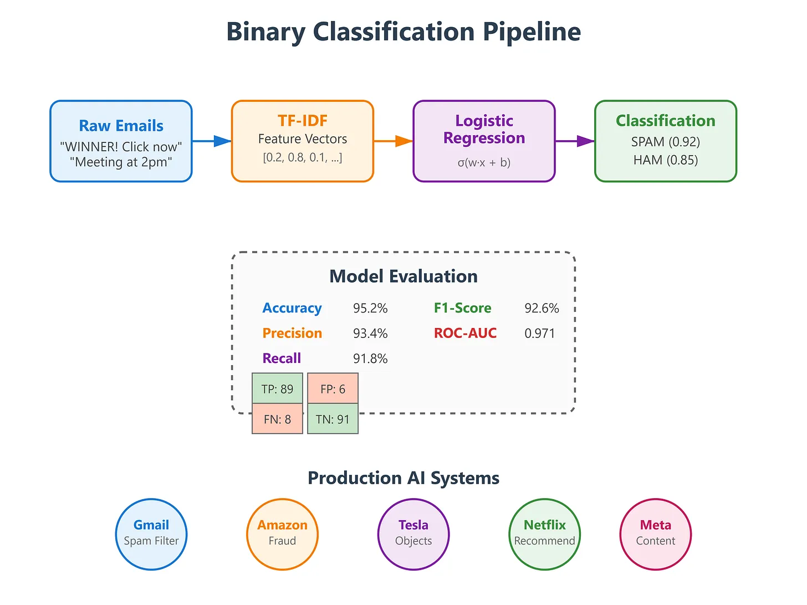

#

<https://aieworks.substack.com/p/day-49-logistic-regression-for-binary>

<https://github.com/sysdr/aiml/tree/main/day49/logistic_regression>

1. Data Prep
2. Feature Engineering
3. Model Training
4. Evaluation
5. Prediction

## Key Concepts

### Binary Classification Pipeline

- **Data Preparation**: Clean and preprocess raw text
- **Feature Engineering**: Convert text to TF-IDF vectors
- **Model Training**: Learn optimal weights via gradient descent
- **Evaluation**: Measure performance with multiple metrics
- **Prediction**: Make real-time classifications

### Evaluation Metrics

- **Accuracy**: Overall correctness
- **Precision**: Of predicted spam, how many are actually spam
- **Recall**: Of actual spam, how many did we catch
- **F1-Score**: Harmonic mean of precision and recall
- **ROC-AUC**: Classifier performance across all thresholds
